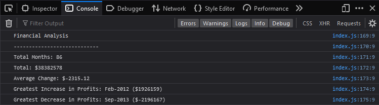

# Challenge 4 - Console Finances

## Description
This is the 4th weekly challenge for UOB's Front End Developr and UX Bootcamp concerning JavaScript.
The task is to create code for analysing the financial records of a company. The financial dataset, composed of arrays with two fields (Date and Profit/Losses), has been provided and is ready to utilise.

## Table of Contents 

[Installation](#installation)
[Usage](#usage)

### Installation

To complete the project, JavaScript code needs to be written, that analyses the records given in the financial dataset.

The steps required to complete the project are as goes: 

* Calculate the total number of months in the dataset.
* Calculate the net total amount of Profit/Losses over the entire period.
* Calculate the average of the __changes__ in Profit/Losses over the entire period. 
* Calculate the greatest __increase__ in profits (date and amount) over the entire period.
* Calculate the greatest __decrease__ in losses (date and amount) over the entire period. 

### Usage

The page is used to see the financial analysis of the company's records in the console.

Screenshot of the page attached for reference:

